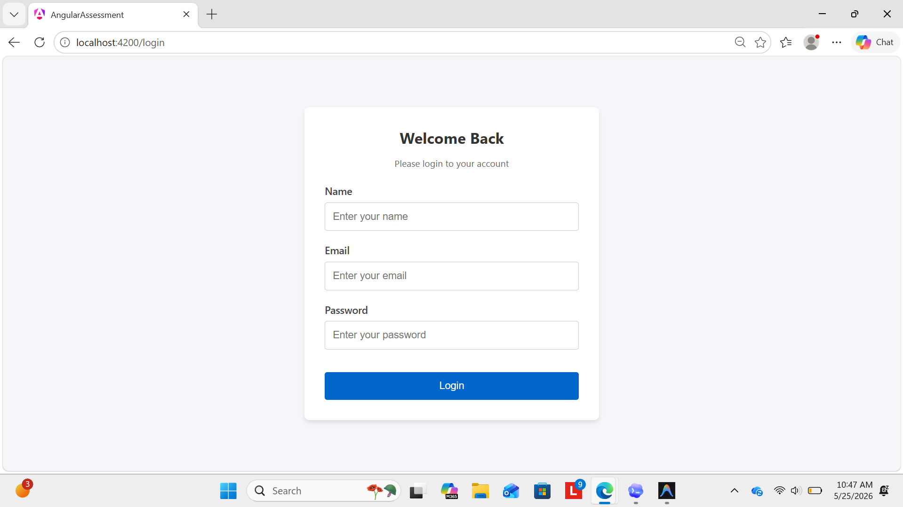
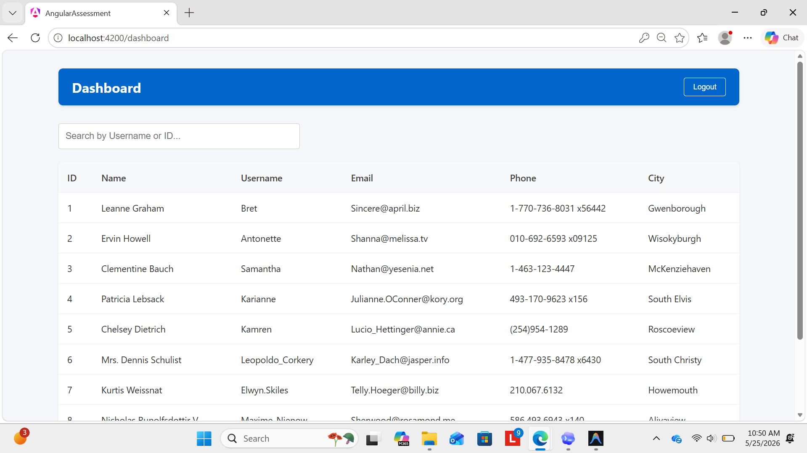
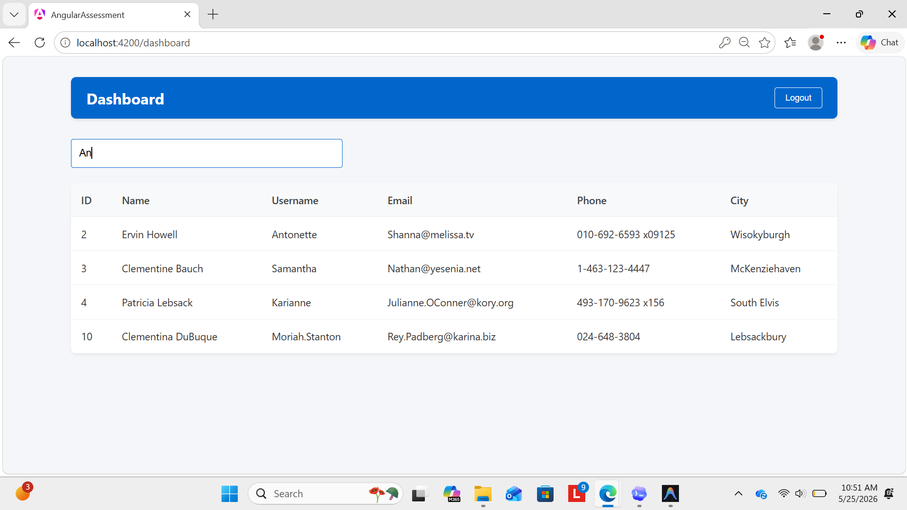

# angular assignment - Output Screenshots

### Login Page
This is the main login page of the application (`Mainpage.png`).

---

### Dashboard
This is the user dashboard that loads after a successful login (`Dashboard.png`).

---

### Filter / Search Feature
This shows the search and filtering functionality in action on the dashboard (`Filter.png`).

